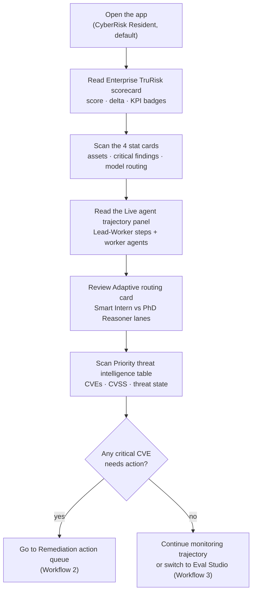
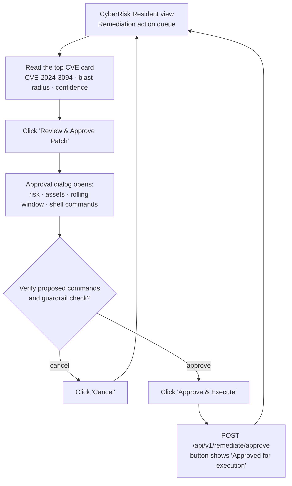
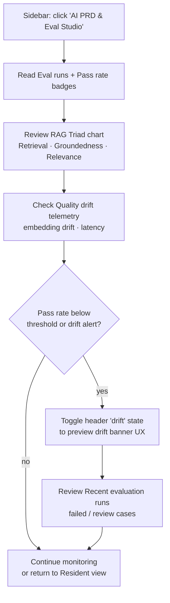
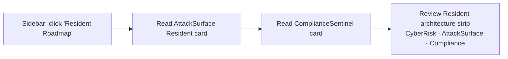
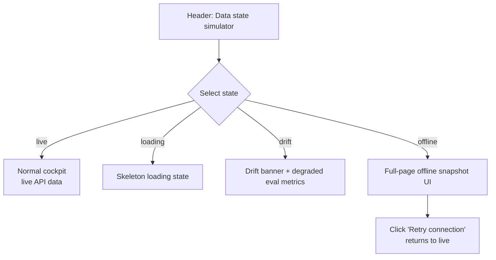

# How to Use HorizonAI

A walkthrough of every workflow implemented in the cockpit UI (`src/routes/index.tsx`), with the
exact clicks each one takes. See `README.md` for how to start the app and `backend/app/api/v1/`
for the backend API surface.

> **Current state:** the CyberRisk Resident cockpit is wired to the live FastAPI backend
> (`backend/app/`). Triage, agent trajectory, model routing, eval metrics, and remediation
> approval all hydrate from `/api/v1/*` endpoints. The header **data state simulator** (live /
> loading / drift / offline) is a client-side demo control — it does not change backend behavior
> except when you select **offline**, which shows the cached snapshot UI.

The app has three primary views in the sidebar, plus a header simulator. The **CyberRisk
Resident** view is the default operational cockpit; **AI PRD & Eval Studio** monitors model
quality; **Resident Roadmap** previews future autonomous operators.

---

## Workflow 1 — Monitor the CyberRisk Resident cockpit

**View:** *CyberRisk Resident* (sidebar, default). This is where you start a session: Enterprise
TruRisk score, asset context, live agent trajectory, and the remediation queue.

**Steps:**
1. Start the app with `./start.sh` (or `.\start.ps1` on Windows) and open **http://127.0.0.1:5173**
   — it lands on **CyberRisk Resident**.
2. Read the **Enterprise TruRisk** scorecard (top left): headline score out of 1000, 24-hour
   risk delta, and the scan ID badge (e.g. `SCAN / CR-0922-0048`).
3. Scan the four KPI badges above the scorecards: **Groundedness**, **Latency P95**, and
   **Model cost / 1k**.
4. Review the four stat cards: **Assets in context**, **Critical findings**, and **Model
   routing** health.
5. Read the **Live agent trajectory** panel: the Lead Agent's plan, tool calls, context
   retrieval, observations, and guardrail checks. Worker agents (Asset mapper, Threat intel,
   Policy verifier) appear inline at the context-retrieval step.
6. Check **Adaptive routing** on the right: which tasks route to the on-prem "Smart Intern"
   vs the escalated "PhD Reasoner".
7. Scroll to **Priority threat intelligence** to see ranked CVEs with CVSS and threat state.
   If a critical item needs action, proceed to Workflow 2.

---

## Workflow 2 — Review and approve a remediation patch (HITL)

**Panel:** *Remediation action queue* (bottom right of CyberRisk Resident). This is the
human-in-the-loop workflow: review the proposed shell commands, verify blast radius, and
authorize production execution.

**Steps:**
1. On the **CyberRisk Resident** view, scroll to the **Remediation action queue** panel.
2. Read the highlighted CVE card (e.g. **CVE-2024-3094**): downgrade strategy, blast radius,
   and model confidence score.
3. Click **Review & Approve Patch** to open the Human-In-The-Loop approval dialog.
4. Inside the dialog, verify:
   - **Risk**, **Assets**, and **Window** summary tiles.
   - The **Proposed shell commands** block (package downgrade, service restart, verification).
   - The **Guardrail check** notice (signed package source, canary rollout, automatic rollback).
5. Click **Approve & Execute** to submit approval to `POST /api/v1/remediate/approve`. On
   success, the button changes to **Approved for execution** with a green checkmark.
6. Click **Cancel** at any time to close without approving.

---

## Workflow 3 — Monitor AI quality in the Eval Studio

**View:** *AI PRD & Eval Studio* (sidebar under Intelligence). This is the production
intelligence workflow: RAG Triad trends, drift telemetry, and recent evaluation runs.

**Steps:**
1. Click **AI PRD & Eval Studio** in the sidebar.
2. Read the headline badges: **Eval runs** count and **Pass rate** percentage (from
   `GET /api/v1/evals`).
3. Review the **RAG Triad · 7 hour window** line chart: Retrieval Quality, Groundedness, and
   Answer Relevance over time (90% threshold line).
4. Check **Quality drift telemetry** on the right: latency area chart and telemetry rows
   (Knowledge freshness, Citation coverage, Embedding drift).
5. If you want to preview the drift UX, use the header **data state simulator** and click
   **drift** — a red **Data Drift Detected** banner appears and pass rate reflects degraded
   values.
6. Scroll to **Recent evaluation runs** to see individual eval case results (Passed / Review).

---

## Workflow 4 — Explore the Resident Roadmap

**View:** *Resident Roadmap* (sidebar). Preview future autonomous operators joining the
HorizonAI control plane.

**Steps:**
1. Click **Resident Roadmap** in the sidebar.
2. Read the two roadmap cards: **AttackSurface Resident** (external recon, shadow IT) and
   **ComplianceSentinel** (CIS auditing, policy drift). Both show **Coming in Phase 4**.
3. Review the **Resident architecture** strip at the bottom — CyberRisk is live; the others are
   preview-only (locked in the sidebar under "Future residents").

---

## Workflow 5 — Simulate data states (header control)

**Control:** *Data state simulator* in the page header (desktop). Lets you preview loading,
drift, and offline UX without stopping the backend.

**Steps:**
1. In the header (visible on medium+ screens), find the four buttons: **live**, **loading**,
   **drift**, **offline**.
2. Click **loading** to see skeleton placeholders across the active view.
3. Click **drift** to surface the **Data Drift Detected** banner and degraded pass-rate values
   in Eval Studio.
4. Click **offline** to show the full-page **Live telemetry unavailable** state with cached
   asset count.
5. Click **Retry connection** (or switch back to **live**) to restore normal API-driven views.
6. If the backend is actually unreachable, a separate **Backend disconnected** banner appears
   with a **Retry API** button — this is independent of the simulator.

---

## Quick reference: which view for which question

| You want to... | Go to |
|---|---|
| Check Enterprise TruRisk score and scan context | CyberRisk Resident |
| Watch the Lead-Worker agent trajectory in real time | CyberRisk Resident → Live agent trajectory |
| See which CVEs are highest priority | CyberRisk Resident → Priority threat intelligence |
| Approve a production remediation patch | CyberRisk Resident → Remediation action queue |
| Monitor RAG Triad quality and eval pass rate | AI PRD & Eval Studio |
| Preview drift or offline UX states | Header data state simulator |
| See what's coming in Phase 4 | Resident Roadmap |
