# End-to-End Workflow

How a Qualys ETM vulnerability scan becomes a human-approved remediation action — from the
moment scan data enters HorizonAI to the eval gates that block silent quality drift. This is the
same pipeline implemented in `backend/app/` and surfaced in the CyberRisk Resident cockpit
(`src/routes/index.tsx`).

```mermaid
flowchart LR
    classDef unchanged fill:#0d1412,stroke:#57d6c4,stroke-width:2px,color:#e7ede9;
    classDef highlight fill:#332409,stroke:#e0a968,stroke-width:2px,color:#f0c48c;
    classDef outcome fill:#0d1412,stroke:#57d6c4,stroke-width:2px,color:#e7ede9;

    A["Qualys scan ingest\n(asset graph + CVE delta)"]:::unchanged
    B["Triage summary\nTruRisk · assets · KPIs"]:::unchanged
    C{"Model routing gate\nFour-Lens engine"}:::highlight
    D["Smart Intern lane\nCVE lookup · on-prem"]:::highlight
    E["PhD Reasoner lane\nattack-chain synthesis"]:::highlight
    F["Lead-Worker orchestration\nplan → tool → retrieve → observe"]:::highlight
    G["Guardrail check\npolicy + blast radius"]:::unchanged
    H["Remediation proposal\nshell commands + confidence"]:::highlight
    I{"Human-in-the-loop\napproval gate"}:::unchanged
    J["Approved execution\nPOST /remediate/approve"]:::outcome
    K["Golden dataset evals\nRAG + trajectory triads"]:::unchanged
    L["Eval Studio dashboard\npass rate · drift telemetry"]:::outcome

    A --> B
    B --> C
    C -- "high volume / lookup" --> D
    C -- "complex reasoning" --> E
    D --> F
    E --> F
    F --> G
    G --> H
    H --> I
    I -- "approved" --> J
    F --> K
    K --> L
```

## Stage-by-stage

1. **Scan ingest.** Qualys ETM scan data (asset graph, CVE observations, policy context) enters
   the HorizonAI control plane. The pilot uses a synthetic scan dataset seeded into PostgreSQL
   (`backend/scripts/seed_data.py`, `golden_dataset.json`).

2. **Triage summary.** The API aggregates scan context into the cockpit headline metrics:
   Enterprise TruRisk score, asset count, critical findings, groundedness, latency P95, and model
   cost (`GET /api/v1/triage`). The UI renders these in the CyberRisk Resident scorecards.

3. **Model routing gate.** The Four-Lens Selection Engine routes tasks by task fit, intelligence
   required, speed/cost, and compliance constraints (`GET /api/v1/models/route`). High-volume
   CVE lookups stay on the on-prem "Smart Intern"; complex attack-chain synthesis escalates to
   the "PhD Reasoner."

4. **Lead-Worker orchestration.** A Lead Agent decomposes the scan delta into parallel worker
   lanes (`backend/app/agents/lead_worker.py`):
   - **Plan** — break the scan delta into exploitable paths.
   - **Tool call** — query the asset graph for affected hosts.
   - **Context retrieval** — pull CVE observations and policy context (worker agents run in
     parallel: Asset mapper, Threat intel, Policy verifier).
   - **Observation** — confirm exploit signatures and threat state.
   - **Guardrail check** — validate policy and blast-radius constraints.

   The live trajectory is exposed at `GET /api/v1/agent/trajectory` and rendered step-by-step in
   the cockpit.

5. **Remediation proposal.** The agent synthesizes a rolling remediation strategy (package
   downgrade, service restart, verification commands) with blast-radius and confidence scores.
   Critical items surface in the **Remediation action queue** panel.

6. **Human-in-the-loop approval gate.** No production change executes without explicit human
   authorization. The operator reviews proposed shell commands, risk summary, and guardrail
   status in the approval dialog, then submits `POST /api/v1/remediate/approve`. This gate is
   non-negotiable for the pilot — autonomous execution requires approval.

7. **Golden dataset evals.** Before and during operation, the eval runner scores agent behavior
   against the 100-case golden dataset (`backend/app/evals/runner.py`, `eval_cases` table):
   - **RAG Triad** — Retrieval Quality, Groundedness, Answer Relevance.
   - **Agent Trajectory Triad** — Tool Selection, Argument Correctness, Task Completion.

   Results feed `GET /api/v1/evals` and the **AI PRD & Eval Studio** dashboard.

8. **Eval Studio dashboard.** Product and security teams monitor pass rate, RAG trends, embedding
   drift, and recent eval runs. Releases are blocked when groundedness or accuracy falls below
   baseline thresholds (pilot: visualized in UI; production: CI gate).

## Legend

| Style | Meaning |
|---|---|
| Amber | Agent orchestration and routing decisions (Lead-Worker, model selection) |
| Teal | Data ingest, guardrails, eval infrastructure, and HITL gates |
